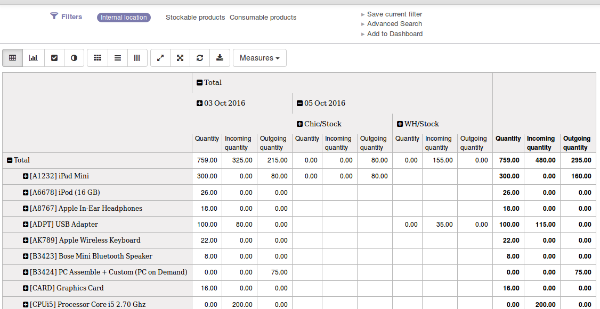

.. image:: https://img.shields.io/badge/licence-LGPL--3-blue.svg
   :target: http://www.gnu.org/licenses/lgpl-3.0-standalone.html
   :alt: License: LGPL-3

=======================
Stock Analysis Forecast
=======================

Backport (with improvements) of the report_stock_forecast analysis view of Odoo 9.

By default, it adds a pivot table grouped by date where lines are products and columns are locations.
Each column is further divided into Quantity, Incoming quantity and Outgoing quantity.
Quantity column doesn't take into account incoming and outgoing quantities.

See example:

Usage
=====

.. image:: https://odoo-community.org/website/image/ir.attachment/5784_f2813bd/datas
   :alt: Try me on Runbot
   :target: https://runbot.odoo-community.org/runbot/151/8.0

Bug Tracker
===========

Bugs are tracked on `GitHub Issues
<https://github.com/OCA/stock-logistics-reporting/issues>`_. In case of trouble, please
check there if your issue has already been reported. If you spotted it first,
help us smashing it by providing a detailed and welcomed feedback.

Credits
=======

Images
------

* Odoo Community Association: `Icon <https://github.com/OCA/maintainer-tools/blob/master/template/module/static/description/icon.svg>`_.

Contributors
------------

* Odoo SA <https://www.odoo.com>
* Alex Comba <alex.comba@agilebg.com>
* Lorenzo Battistini <lorenzo.battistini@agilebg.com>

**This module is a backport from Odoo SA and as such, it is not included in the OCA CLA.
That means we do not have a copy of the copyright on it like all other OCA modules.**

Maintainer
----------

.. image:: https://odoo-community.org/logo.png
   :alt: Odoo Community Association
   :target: https://odoo-community.org

This module is maintained by the OCA.

OCA, or the Odoo Community Association, is a nonprofit organization whose
mission is to support the collaborative development of Odoo features and
promote its widespread use.

To contribute to this module, please visit https://odoo-community.org.
